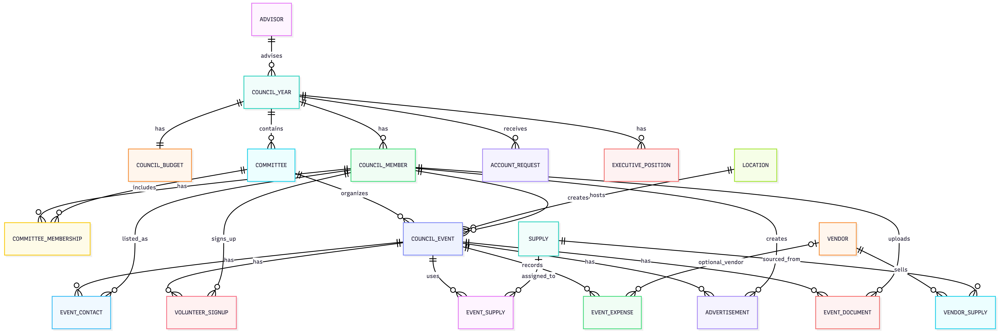

# HooPlannedThis

HooPlannedThis is an event operations platform for UVA Class Council. It helps council members coordinate events, committees, members, volunteers, supplies, vendors, expenses, advertisements, and event documents from one shared system.

The application uses a React frontend, an Express API, MySQL/RDS for relational data, and private S3 storage for uploaded event documents and receipts.

## Features

- Event creation, listing, editing, and committee ownership
- Class council and committee management
- Council member profiles, account requests, and admin approval flow
- Volunteer signup and staffing coordination
- Budget, expense, supply, and vendor tracking
- Advertisement planning and event contact management
- Private S3-backed document and receipt uploads
- Short-lived presigned URLs for authorized document access
- Health and readiness checks for database and S3 connectivity

## Tech Stack

- **Frontend:** React, Vite, React Router, Mapbox, Recharts
- **Backend:** Node.js, Express, JWT authentication
- **Database:** MySQL with AWS RDS deployment support
- **File Storage:** AWS S3 with private objects and presigned URLs
- **Infrastructure:** EC2, systemd, IAM instance role, environment-based configuration
- **Testing:** Node's built-in test runner, ESLint, Vite build checks

## Database Design

HooPlannedThis uses a normalized relational schema to support event planning, committee management, member coordination, volunteer signups, supply tracking, vendor management, expense records, advertisements, and event documents.



[View the full ERD](docs/HooPlannedThis-ERD-Full.png)

## Core Data Model

The database centers on class council operations:

- **CouncilYear** defines each council class year and academic year.
- **Committee** groups work within a council year.
- **CouncilMember**, **CommitteeMembership**, and **ExecutivePosition** model member access and leadership.
- **CouncilEvent** stores event details and committee ownership.
- **VolunteerSlot** and **VolunteerSignup** track staffing needs.
- **Supply**, **Vendor**, **VendorSupply**, **EventSupply**, and **EventExpense** support event operations and spending.
- **EventAdvertisement** and **EventContact** coordinate promotion and points of contact.
- **EventDocument** stores document metadata while file contents live in private S3 objects.

## Project Structure

```text
client/              React/Vite frontend
server/              Express API and MySQL models
server/migrations/   Database schema and migrations
docs/                Deployment notes and ERD images
SECURITY.md          S3, IAM, and runtime secret guidance
```

## Setup

Create local environment files:

```bash
cp server/.env.example server/.env
cp client/.env.example client/.env
```

Install dependencies:

```bash
cd server
npm install

cd ../client
npm install
```

## Environment Variables

Server configuration is documented in `server/.env.example`. Key settings include:

```text
PORT=4000
JWT_SECRET=<local-development-secret>
DB_HOST=<database-host>
DB_NAME=<database-name>
DB_USER=<database-user>
DB_PASSWORD=<database-password>
AWS_REGION=us-east-1
S3_BUCKET_NAME=<s3-bucket-name>
S3_EVENT_FILES_PREFIX=class-council-events
```

Client configuration is documented in `client/.env.example`:

```text
VITE_API_URL=http://localhost:4000
VITE_TOKEN=<mapbox-token>
```

Do not commit real `.env` files or production secrets.

## Running Locally

Start the API:

```bash
cd server
npm start
```

Start the frontend in another terminal:

```bash
cd client
npm run dev
```

Default local ports:

- API: `http://localhost:4000`
- Vite client: `http://localhost:5173`

## Checks

Run backend tests:

```bash
cd server
npm test
```

Run the frontend build:

```bash
cd client
npm run build
```

The server tests mock AWS S3 calls and do not require real AWS credentials.

## Deployment Notes

Production deployment details are in [docs/DEPLOYMENT.md](docs/DEPLOYMENT.md).

The current production pattern uses:

- EC2 running the Express API through `systemd`
- RDS MySQL for relational data
- S3 private objects for document storage
- IAM instance role credentials instead of committed AWS keys
- `/api/health` for database health
- `/api/readiness` for database and S3 readiness

## Project Status

HooPlannedThis is production-oriented course project software with deployed AWS infrastructure support. Current work focuses on hardening event operations workflows, database reliability, and private document storage.
